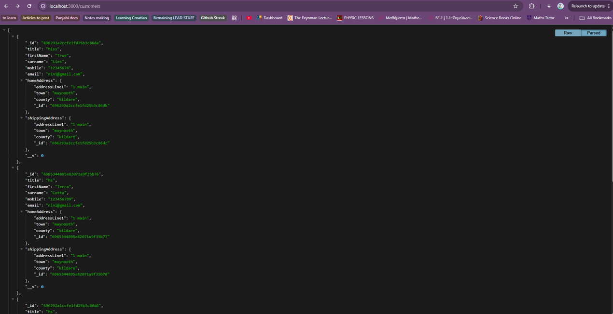

# Mobile Store REST API

A small backend project I built for a university assignment. It uses Node.js, Express and MongoDB to create a REST API for a mobile phone store.

There is no frontend in this project. Everything was tested using Postman.

## Screenshot

## Features

- Create customers
- Retrieve customers
- Update customers
- Delete customers
- Create phone items
- Create orders
- Connect orders to customers and items
- MongoDB database using Mongoose
- REST API routes with Express

## What I Learned

This project was my first time building a REST API with Express and MongoDB.

I learned how routes work and how different HTTP methods like GET, POST, PUT and DELETE are used to perform CRUD operations.

I also learned how to use Mongoose schemas and models to give structure to MongoDB collections and add validation to fields.

Another thing I learned was how to separate code into models, controllers and routes instead of putting everything inside one file. This made the project easier to understand and maintain.

I also learned about MongoDB references and ObjectIds. Orders stored references to customers and items instead of duplicating the data.

One of the coolest things I learned was the .populate() method as itt allowed me to replace ObjectIds with the actual customer and item information when retrieving orders, making the responses much easier to read.
